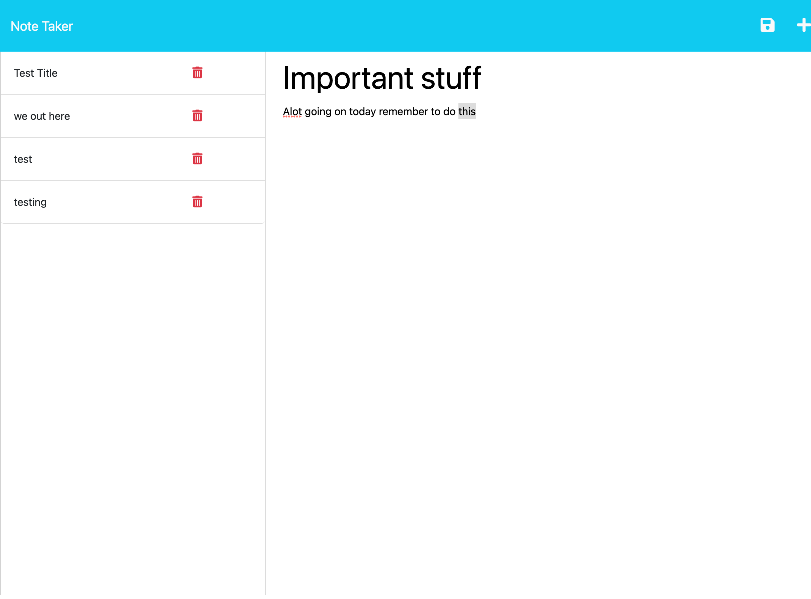

# Title: Note Taker

## Description: 
This application helps you write notes on a live server to keep organized. I used node js with express and npm to install all the necessary json packages to make it run from the backend with the front end. I faced the challenges of where to put specific api routes like the wildcard and where it was breaking the rest of my calls. It would be ideal to implement an organizer maybe with the time or drag and drop function as well.

## Install:
Download the github repo install node js, npm install for all the other json packages.

## Run:
You can run the app from the heroku link or by typing node server.js getting the local route then running it through a web browser locally. heroku link : https://quiet-plateau-10044-64d9177327af.herokuapp.com/

## Use:
Open app type a title then type a note and click save and it should save to the left column of your screen.

## License:
MIT

Screenshot: 
Link: https://quiet-plateau-10044-64d9177327af.herokuapp.com/